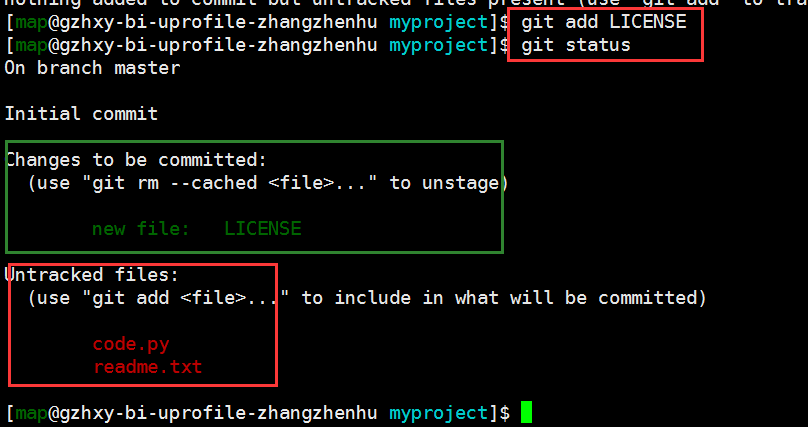
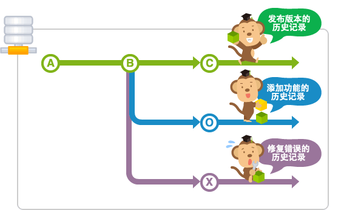
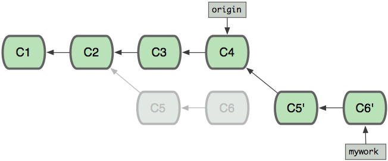
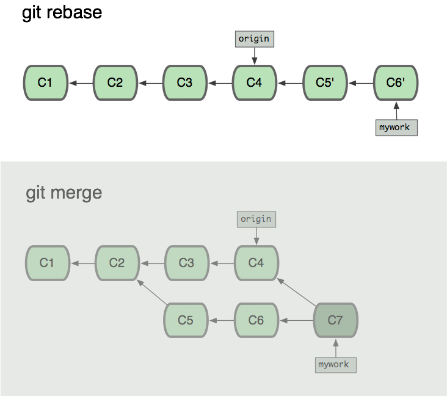

Git代码版本管理系统
===================

**git是团队开发的利器！**

什么是git
---------

一个分布式的代码版本管理的系统。
每个开发者在本地有自己的版本管理，多个开发者通过远程代码库进行同步。

-  版本管理

    记录下对于文件的修改，并且可回溯。

    支持多分支管理。

-  分布式

    每个开发者都有自己的版本库，并且和同一个远程版本库进行同步，以达到多个开发者协同工作，代码的同步整合等等。

.. figure:: media/image002.png
    :align: center

    `图片引用自:http://backlogtool.com/git-guide/cn/ <http://backlogtool.com/git-guide/cn/>`__

**关键点：**

    * 本地是一个完整的代码库，拥有完整的代码版本管理功能。

    * 本地库可以关联远程库，多个开发者关联相同远程库实现多人协作，代码同步。

安装
----

从官方下载对应版本即可

`https://git-scm.com/downloads <https://git-scm.com/downloads>`__

windows版本安装完成后有三个工具

- Git Bash：

    一个类linux bash的windows
    版本，并且集成了一些linux下的常用命令，符合linux的习惯，方便快捷。建议使用这个。

- Git CMD：

    Windows cmd环境，习惯cmd的同学可以使用

- Git GUI:

    一个简单的可视化工具，非常简陋，不建议使用。

初始化
----------------

git在安装后初次使用前，需要配置开发者的信息，包含开发者的邮件和名称。这是为了当多个开发者协作开发时，能够区分出不同开发者修改的内容。
::
    git config --global user.email "you@example.com"
    git config --global user.name "Your Name"

其它更详尽的配置项请参照官方文档 `https://git-scm.com/docs/git-config <https://git-scm.com/docs/git-config>`__

创建代码库
----------

创建代码库的方法有两种

- 本地创建全新的数据库
- 从远程仓库拉取到本地

    `图片引用自:http://backlogtool.com/git-guide/cn/ <http://backlogtool.com/git-guide/cn/>`__

创建全新的本地库
~~~~~~~~

创建一个代码库使用命令 ``git init`` ，运行命令的当前目录可以存在代码文件，也可以空文件夹。

运行此命令后会在当前目录生成一个隐藏目录 ``.git`` ，这个 ``.git`` 目录下包含了代码库的所有信息和数据。

git和svn不同的地方就在于，svn会在项目每个子目录下都生成一个 ``.svn`` 目录用于保存代码库信息，而git仅仅在项目的根目录下生成一个 ``.git`` 目录，
其它子目录下不会生成任何信息。

判断一个项目是否由git进行了管理，就依据是否存在 ``.git`` 目录。

其它更详尽的配置项请参照官方文档 `https://git-scm.com/docs/git-init <https://git-scm.com/docs/git-init>`__

从远程库拉取
~~~~~~

从远程库拉取代码使用命令 ``git clone``
::
    usage: git clone [<options>] [--] <远程库地址> [保存路径]

    clone 代表从远程库复制

    -b 参数指定要拉取远程库的哪个分支

其它更详尽的配置项请参照官方文档 `https://git-scm.com/docs/git-clone <https://git-scm.com/docs/git-clone>`__

例如，从效率云拉取代码，首先打开效率云的模块代码首页，点击左侧的 ``克隆代码库`` ，就会弹出代码库的完整的克隆命令

复制 ``克隆并安装hook`` 一栏中的命令，然后粘贴到终端执行即可

我们分析一下这条命令的组成
::
    git
    clone
    https://<你的效率云登陆账号>@xiaolvyun.baidu.com/git/waimai/uprofile/basic-data  # 代码库地址
    waimai/uprofile/basic-data  # 代码库保存到本地的目录路径
    &&  # shell 命令的逻辑操作符
    curl -s https://xiaolvyun.baidu.com/git/tools/hooks/commit-msg  # 拉取效率云的hook信息
    > waimai/uprofile/basic-data/.git/hooks/commit-msg  # hook信息的保存位置，注意是要保存到本地代码库里面的
    && # shell 命令的逻辑操作符
    chmod u+x waimai/uprofile/basic-data/.git/hooks/commit-msg # hook文件增加执行权限

效率云提供的这条命令其实是三条shell命令的集合（用 ``&&`` 隔开）

- git clone 命令，拉取代码库并且保存到本地。
    这个是我们讲的git的标注命令，用来获取远程代码库到本地。注意远程代码库的url地址中是包含了你的个人效率云账号的。
- curl 命令，拉取hook信息，并且保存到本地代码库里。
- chomd 命令，增加hook文件的可执行权限。

.. hint::
    什么是hook?
        hook是效率云代码库增加的功能，
        所谓hook就是在开发者向远程库提交代码的过程中，会先经过一些额外的处理（比如：代码规范检查等等）再提交到远程库。

远程仓库管理
------

对于通过命令 ``git init`` 创建的本地仓库，初始状态其是未绑定任何远程远程库的。

对于通过命令 ``git clone`` 拉取到本地的代码库，是自动绑定了远程库的。

我们可通过命令 ``git remote`` 管理其绑定的远程库。

添加远程仓库
~~~~~~

.. hint::
    - 一个本地库是可以绑定多个远程库的
    - 通过 ``git clone`` 命令从远程拉取的代码，默认就已经绑定好远程库（就是你所拉取的那个远程库地址），并且起名字为origin
    - 每个远程库都会有一个名字，比如origin

运行 ``git remote add <shortname> <url>`` 为当前本地代码库添加一个新的远程Git仓库，同时指定一个名称
::
    $ git remote -v  # 当前只有一个远程库，名字是origin

    origin https://github.com/schacon/ticgit (fetch)

    origin https://github.com/schacon/ticgit (push)

    $ git remote add pb https://github.com/paulboone/ticgit  # 添加另一个远程库，并且命名为pb

    $ git remote -v # 两个远程库，名字分别是origin ob

    origin https://github.com/schacon/ticgit (fetch)

    origin https://github.com/schacon/ticgit (push)

    pb https://github.com/paulboone/ticgit (fetch)

    pb https://github.com/paulboone/ticgit (push)

查看远程仓库
~~~~~~

查看当前代码库所绑定的远程仓库，可以运行 ``git remote -v`` 命令，如果你的远程仓库不止一个，该命令会将它们全部列出。
::
    $ git remote -v

    origin http://zhangzhenhu_iwaimai.baidu.com_waimai@xiaolvyun.baidu.com/git/waimai/uprofile/basic-data (fetch)

    origin http://zhangzhenhu_iwaimai.baidu.com_waimai@xiaolvyun.baidu.com/git/waimai/uprofile/basic-data (push)

如果想要查看某一个远程仓库的更多信息，可以使用 ``git remote show [remote-name]`` 命令。 
如果想以一个特定的缩写名运行这个命令，例如 origin，会得到像下面类似的信息：
::
    $ git remote show origin
    Password for 'http://zhangzhenhu_iwaimai.baidu.com_waimai@xiaolvyun.baidu.com':
    * remote origin
        Fetch URL: http://zhangzhenhu_iwaimai.baidu.com_waimai@xiaolvyun.baidu.com/git/waimai/uprofile/basic-data
        Push  URL: http://zhangzhenhu_iwaimai.baidu.com_waimai@xiaolvyun.baidu.com/git/waimai/uprofile/basic-data
        HEAD branch: master
        Remote branches:
            bi-profile-206 tracked
            bi-profile-75  tracked
            bi-profile-93  tracked
            bi-profile-98  tracked
            dafenqi_test   tracked
            dev            tracked
            master         tracked
            xby2_3         tracked
            zhangzhenhu    tracked
        Local branches configured for 'git pull':
            bi-profile-206 merges with remote bi-profile-206
            dafenqi_test   merges with remote dafenqi_test
            dev            merges with remote dev
            zhangzhenhu    merges with remote zhangzhenhu
        Local refs configured for 'git push':
            bi-profile-206 pushes to bi-profile-206 (up to date)
            dafenqi_test   pushes to dafenqi_test   (local out of date)
            dev            pushes to dev            (local out of date)
            zhangzhenhu    pushes to zhangzhenhu    (local out of date)

它会列出远程仓库的 URL 与跟踪分支的信息，这些信息非常有用。

远程仓库的移除与重命名
~~~~~~~~~~~

如果想要重命名引用的名字可以运行  ``git remote rename``  去修改一个远程仓库的简写名。 
例如，想要将 name1 重命名为 name2
::
    $ git remote rename name1 name2

    $ git remote

    origin

    name2

.. important::

    值得注意的是这同样也会修改你对于远程分支引用的名字。
    那些过去引用 name1/master 的现在会引用name2/master。

如果因为一些原因想要移除一个远程仓库，可以使用 ``git remote rm``
::
    $ git remote rm name2

    $ git remote

    origin

提交修改到本地库
--------

工作区、暂存区和版本库
~~~~~~~~~~~

Git和其他版本控制系统如SVN的一个不同之处就是有暂存区的概念。

.. figure:: media/image011.jpg
    :align: center

    `图片引用自:聊雪峰网站 <http://www.liaoxuefeng.com/wiki/0013739516305929606dd18361248578c67b8067c8c017b000/0013745374151782eb658c5a5ca454eaa451661275886c6000>`__

- 工作区（Working Directory）

就是你在电脑里能看到的目录，当前项目文件夹就是工作区，代码文件的编辑修改都是在工作区。

.. hint::

    **工作区（Working Directory）**\ 面的所有文件都不外乎这两种状态：已跟踪或未跟踪。

    **已跟踪**\ 的文件是指本来就被纳入版本控制管理的文件，反之未纳入版本控制管理的文件就是 **未跟踪**\ 。

- 版本库（Repository）

工作区有一个隐藏目录.git，这个不算工作区，而是Git的版本库，这里面保存着版本库相关的所有信息。

- 暂存区（Stage）

暂存区是一个抽象概念，是位于工作区和版本库之间的一个区域，用于暂存尚未提交到版本库的修改。
工作区代码的所有新加、修改都要先提交到暂存区，然后再提交到版本库。

.. figure:: media/image013.png
    :align: center

    `图片来自网络`

把 **未跟踪文件** 或者 **已跟踪文件的修改** 往Git版本库（Repository）里添加的时候，是分两步执行的：

第一步是用 ``git add`` 把工作区（Working Directory）的文件( **未跟踪文件** 或者 **已跟踪文件的修改** )添加到暂存区（Stage）；

第二步是用 ``git commit`` 把暂存区（Stage）的所有内容提交到版本库（Repository）。

你可以简单理解为，需要提交的文件修改通通放到暂存区，然后，一次性提交暂存区的所有修改。

现在，暂存区的状态就变成这样了：

.. figure:: media/image014.jpg
    :align: center

    `图片引用自:聊雪峰网站 <http://www.liaoxuefeng.com/wiki/0013739516305929606dd18361248578c67b8067c8c017b000/0013745374151782eb658c5a5ca454eaa451661275886c6000>`__

可以多次使用 ``git add`` 命令文件的修改放到暂存区（Stage），然后执行 ``git commit`` 就可以一次性把暂存区的所有修改提交到分支。

.. important::
    暂存区是Git非常重要的概念，弄明白了暂存区，就弄明白了Git的很多操作到底干了什么。

提交修改
~~~~~~~~

执行 ``git status`` 命令查询当前的状态，红色字体显示出当前 **工作区** 尚未跟踪(Untracked files)的文件。

执行 ``git add`` 命令把 未跟踪的文件加到 **暂存区** （也是把未跟踪文件变成已跟踪）。
绿色字体显示出位于暂存区的文件。

执行 ``git commit`` 命令把 **暂存区** 文件提交到 **版本库**

到这里我们就把文件LICENSE提交到版本库了，并且文件变成已跟踪文件。
如果我们再次修改LICENSE文件，就需要重新执行 git add -> git commit 进行提交到版本库，仔细看下图的展示。

提交命令的说明
::
    git add <path>

        | 表示 add to index only files created or modified and not those
          deleted 
        | 我通常是通过git
          add <path>的形式把我们<path>添加到索引库中，<path>可以是文件也可以是目录。

        只要在 “Changes to be committed” 这行下面的，就说明是已暂存状态。

        git不仅能判断出<path>中，修改（不包括已删除）的文件，还能判断出新添的文件，并把它们的信息添加到索引库中。

    git add -u

        git add -u [<path>]:
        把<path>中所有tracked文件中被修改过或已删除文件的信息添加到暂存区。它不会处理untracked的文件。

        省略<path>表示.,即当前目录。

    git add -A

        | git
          add -A: [<path>]表示把<path>中所有tracked文件中被修改过或已删除文件和所有untracked的文件信息添加到索引库。
        | 省略<path>表示.,即当前目录。

    git commit  -m "提交的描述信息"

        如果我们这里不用-m参数的话，git将调到一个文本编译器（通常是vim）来让你输入提交的描述信息

        可能一天下来，你对工作树中的许多文档都进行了更新（文档添加、修改、删除），但是我忘记了它们的名字，此时若将所做的全部更新添加到索引中，比较轻省的做法就是：

    git commit -a -m "提交的描述信息"

        git
        commit 命令的-a 选项可只将所有被修改或者已删除的且已经被git管理的文档提交倒仓库中。如果只是修改或者删除了已被Git
        管理的文档，是没必要使用git add 命令的。

        git
        add .命令除了能够判断出当前目录（包括其子目录）所有被修改或者已删除的文档，还能判断用户所添加的新文档，并将其信息追加到索引中。

    git commit --amend 

        对于已经修改提交过的注释，如果需要修改，可以借助 git commit --amend
        来进行。

  

撤销修改
~~~~~~~~

你可以发现，Git会告诉你，git checkout -- file可以丢弃 **工作区** 的修改：
::
    $ git checkout -- readme.txt

命令git checkout --
readme.txt意思就是，把readme.txt文件在工作区的修改全部撤销，这里有两种情况：

一种是readme.txt自修改后还没有被放到暂存区，现在，撤销修改就回到和版本库一模一样的状态；

一种是readme.txt已经添加到暂存区后，又作了修改，现在，撤销修改就回到添加到暂存区后的状态。

.. important::
    这个命令是把当前 **工作区** 的一个文件恢复撤销到某个状态，
    如果 **暂存区** 有这个文件就用 **暂存区** 的状态覆盖 **工作区** 的文件，
    否则就用 **版本库** 里的状态覆盖 **工作区** 的文件

忽略某些文件
~~~~~~~~~~~~

一般我们总会有些文件无需纳入 Git
的管理，也不希望它们总出现在未跟踪文件列表。通常都是些自动生成的文件，比如日志文件，或者编译过程中创建的临时文件等。\ **我们可以在当前工程下创建一个名为
.gitignore 的文件**\ ，列出要忽略的文件模式，来看一个实际的例子。

提交本地更新到远程库
--------------------

要想把本地库的代码提交到远程库，就需要和远程库进行数据传输。
git本地库和远程库通信的协议有两种：

- ssh 协议

- http(s) 协议

通过远程库的url地址的协议头就能区分出来。
另外，一般情况下远程库都会启用身份验证，必须要通过验证才能提交上去，采用不同的通信协议，验证的方式也不同。

安全认证
~~~~~~~~

ssh协议

当使用ssh协议时，认证的方式采用rsa密钥的方式，免去每次输入账号密码的麻烦。

基本原理是，每个开发者机器生成一个唯一的密码对（两个密码：一个用来加密，一个用来解密。注意这里加密和解密的密码是不一样的哦！这叫非对称加密，有兴趣的可以了解），
私钥（用来加密）自己保留并且不能外泄，公钥（用来解密）提交给远程库管理系统。认证过程就是利用这个密码对实现，详细过程不表。

- 第1步：创建SSH的密码对
    在用户主目录下，看看有没有.ssh目录，如果有，再看看这个目录下有没有id\_rsa和id\_rsa.pub这两个文件。
    如果已经有了，可直接跳到下一步。如果没有，打开Shell（Windows下打开Git Bash），创建SSH Key：
    ::
        $ ssh-keygen -t rsa -C "youremail@example.com"

    你需要把邮件地址换成你自己的邮件地址，然后一路回车，使用默认值即可，由于这个Key也不是用于军事目的，所以也无需设置密码。

    如果一切顺利的话，可以在用户主目录里找到.ssh目录，里面有id\_rsa和id\_rsa.pub两个文件，这两个就是SSH
    Key的秘钥对，id\_rsa是私钥，不能泄露出去，id\_rsa.pub是公钥，可以放心地告诉任何人。

    .. image:: media/image021.png
        :align: center

- 第2步：配置远程库管理系统
    登陆GitHub，打开“Account settings”，“SSH Keys”页面：
    然后，点“Add SSH
    Key”，填上任意Title，在Key文本框里粘贴id\_rsa.pub文件的内容：

    .. image:: media/image022.png

    点“Add Key”，你就应该看到已经添加的Key：

    .. image:: media/image023.png

.. hint::
    为什么GitHub需要SSH Key呢？
    因为GitHub需要识别出你推送的提交确实是你推送的，而不是别人冒充的，而Git支持SSH协议，所以，GitHub只要知道了你的公钥，就可以确认只有你自己才能推送。

    当然，GitHub允许你添加多个Key。假定你有若干电脑，你一会儿在公司提交，一会儿在家里提交，只要把每台电脑的Key都添加到GitHub，就可以在每台电脑上往GitHub推送了。

    最后友情提示，在GitHub上免费托管的Git仓库，任何人都可以看到喔（但只有你自己才能改）。所以，不要把敏感信息放进去。

    如果你不想让别人看到Git库，有两个办法，一个是交点保护费，让GitHub把公开的仓库变成私有的，这样别人就看不见了（不可读更不可写）。另一个办法是自己动手，搭一个Git服务器，因为是你自己的Git服务器，所以别人也是看不见的。这个方法我们后面会讲到的，相当简单，公司内部开发必备。

    确保你拥有一个GitHub账号后，我们就即将开始远程仓库的学习。

http(s)协议

    公司的效率云目前仅支持http(s)的方式，不支持ssh，并且在开发机、测试机要把https改成http，window机器无需更改。

http(s)的认证很简单，就是每次和远程库交互时要输入密码（url里已经包含了用户名）

提交到远程库
~~~~~~~~~~~~

提交到远程库使用命令 ``git push``

.. figure:: media/image027.png
    :align: center

    `图片引用自:http://backlogtool.com/git-guide/cn/ <http://backlogtool.com/git-guide/cn/>`__

如果尚未绑定远程库
::
    $ git push ssh://git@dev.lemote.com/rt4ls.git master

如果已经绑定了远程库
::
    $ git push origin master # origin代表已绑定远程库的名字 master代表提交到远程库的分支名字

上面的命令省略了本地分支名字，完整的命令形式是
::
  $ git push origin test:master   # 提交本地test分支 到远程库origin的master分支
  $ git push origin test:test    # 提交本地test分支 到远程库origin的test分支

.. hint::
    如果想删除远程的分支呢？类似于上面，如果左边的分支为空，那么将删除右边的远程的分支

    $ git push origin :test # 刚提交到远程的test将被删除，但是本地还会保存的

拉取远程更新到本地
---------

拉取更新
~~~~

``git pull`` 命令的作用是，取回远程主机某个分支的更新，再与本地的指定分支合并。

    `图片引用自:http://backlogtool.com/git-guide/cn/ <http://backlogtool.com/git-guide/cn/>`__

它的完整格式稍稍有点复杂。
::
    $ git pull <远程库名字> <远程分支名>:<本地分支名>

比如，取回origin主机的next分支，与本地的master分支合并，需要写成下面这样。
::
    $ git pull origin next:master

如果远程分支是与当前分支合并，则冒号后面的部分可以省略。
::
    $ git pull origin next

更简单点，拉取当前分支对应的远程分支，并且更新到当前分支
::
    $ git pull

合并冲突
~~~~

当多个人协作开发时，如果两个人都修改了同一个文件，并且先后提交的到远程库时，先提交的人可以正常提交，后提交的人就会面临冲突。

.. figure:: media/image029.png
    :align: center

    `图片引用自:http://backlogtool.com/git-guide/cn/ <http://backlogtool.com/git-guide/cn/>`__

.. important::
    当产生冲突后，必须人工解决冲突后才能再次提交。

这种情况下，在读取别人push的变更并进行合并操作之前，你的push都将被拒绝。这是因为，如果不进行合并就试图覆盖已有的变更记录的话，其他人push的变更（图中的提交C）就会丢失

如果远程数据库和本地数据库的同一个地方都发生了修改的情况下，因为无法自动判断要选用哪一个修改，所以就会发生冲突。

这时候你需要先 ``git pull`` ，把远程的更新合并到本地，解决冲突的地方，然后再push。

.. figure:: media/image030.png
    :align: center

    `图片引用自:http://backlogtool.com/git-guide/cn/ <http://backlogtool.com/git-guide/cn/>`__

Git会在发生冲突的地方修改文件的内容，如下图。所以我们需要手动修正冲突。

    `图片引用自:http://backlogtool.com/git-guide/cn/ <http://backlogtool.com/git-guide/cn/>`__

| ==分割线上方是本地数据库的内容, 下方是远程数据库的编辑内容。

如下图所示，修正所有冲突的地方之后，执行提交。

    `图片引用自:http://backlogtool.com/git-guide/cn/ <http://backlogtool.com/git-guide/cn/>`__

.. hint::
    在多人协作开发中，应该尽量避免冲突的产生。由于冲突是发生在同一个文件不同人修改的情况下，所以在多人协作分工时应尽量避免同时修改一个文件。

分支管理
--------

什么是分支
~~~~~~~~~~

分支是为了将修改记录的整体流程分叉保存。分叉后的分支不受其他分支的影响，所以在同一个数据库里可以同时进行多个修改，分叉的分支可以合并。

    `图片引用自:http://backlogtool.com/git-guide/cn/ <http://backlogtool.com/git-guide/cn/>`__

下面是使用分支进行作业的图示。

为了不受其他开发人员的影响，您可以在主分支上建立自己专用的分支。完成工作后，将自己分支上的修改合并到主分支。因为每一次提交的历史记录都会被保存，所以当发生问题时，定位和修改造成问题的提交就容易多了。

.. figure:: media/image040.png
    :align: center

    `图片引用自:http://backlogtool.com/git-guide/cn/ <http://backlogtool.com/git-guide/cn/>`__

master分支

在数据库进行最初的提交后,
Git会创建一个名为master的分支。因此之后的提交，在切换分支之前都会添加到master分支里。

    `图片引用自:http://backlogtool.com/git-guide/cn/ <http://backlogtool.com/git-guide/cn/>`__

分支的运用
~~~~~~~~~~

在Git您可以自由地建立分支。但是，要先确定运用规则才可以有效地利用分支。

这里我们会介绍两种分支 (“Merge分支”和 “Topic分支” ) 的运用规则。

**Merge分支**

Merge分支是为了可以随时发布release而创建的分支，它还能作为Topic分支的源分支使用。保持分支稳定的状态是很重要的。如果要进行更改，通常先创建Topic分支，而针对该分支，可以使用Jenkins之类的CI工具进行自动化编译以及测试。

通常，大家会将master分支当作Merge分支使用。

    `图片引用自:http://backlogtool.com/git-guide/cn/ <http://backlogtool.com/git-guide/cn/>`__

**Topic分支**

Topic分支是为了开发新功能或修复Bug等任务而建立的分支。若要同时进行多个的任务，请创建多个的Topic分支。

Topic分支是从稳定的Merge分支创建的。完成作业后，要把Topic分支合并回Merge分支。

    `图片引用自:http://backlogtool.com/git-guide/cn/ <http://backlogtool.com/git-guide/cn/>`__

创建分支
~~~~~~~~

创建名为issue1的分支。

您可以通过branch命令来创建分支。
::
    $ git branch <branchname>

创建名为issue1的分支。
::
    $ git branch issue1

不指定参数直接执行branch命令的话，可以显示分支列表。
前面有\*的就是现在的分支。
::
    $ git branch

    issue1

    * master

目前的历史记录是这样的。

.. figure:: media/image046.png
    :align: center

    `图片引用自:http://backlogtool.com/git-guide/cn/ <http://backlogtool.com/git-guide/cn/>`__

分支切换
~~~~~~~~

**HEAD指针**

git内部维护着一个指针变量 `HEAD` ，这个 `HEAD` **指向的是当前使用中的分支的最后一次更新**\ 。

.. figure:: media/image043.png
    :align: center

    `图片引用自:http://backlogtool.com/git-guide/cn/ <http://backlogtool.com/git-guide/cn/>`__

通过移动HEAD，就可以实现了变更使用的分支的效果。

.. hint::
    实际上，当我们每次执行 `git commit`  命令时，git会生成一次提交状态追加到当前 `head` 指针所指的状态节点后面，
    然后把 `HEAD` 指针移动到本次提交，这样 `HEAD` 就一直指向当前最新的提交状态。

.. hint::

    提交时使用~(tilde)和^(caret)就可以指定某个提交的相对位置。最常用的就是相对于HEAD的位置。HEAD后面加上~(tilde）可以指定HEAD之前的提交记录。合并分支会有多个根节点，您可以用^(caret)
    来指定使用哪个为根节点。

.. figure:: media/image044.png
    :align: center

    `图片引用自:http://backlogtool.com/git-guide/cn/ <http://backlogtool.com/git-guide/cn/>`__

若要在新建的issue1分支进行提交，需要切换到issue1分支。

要执行checkout命令以退出分支。
::
    $ git checkout <branch name>

切换到issue1分支。
::
    $ git checkout issue1

    Switched to branch 'issue1'

目前的历史记录是这样的。

.. figure:: media/image047.png
    :align: center

    `图片引用自:http://backlogtool.com/git-guide/cn/ <http://backlogtool.com/git-guide/cn/>`__

在checkout命令指定 -b选项执行，可以创建新分支并进行切换。
::
    $ git checkout -b <new local branch name> <remote branch name>

    `图片引用自:http://backlogtool.com/git-guide/cn/ <http://backlogtool.com/git-guide/cn/>`__

.. hint::

    **stash**

    还未提交的修改内容以及新添加的文件，留在索引区域或工作树的情况下切换到其他的分支时，修改内容会从原来的分支移动到目标分支。

    但是如果在checkout的目标分支中相同的文件也有修改，checkout会失败的。这时要么先提交修改内容，要么用stash暂时保存修改内容后再checkout。

    stash是临时保存文件修改内容的区域。stash可以暂时保存工作树和索引里还没提交的修改内容，您可以事后再取出暂存的修改，应用到原先的分支或其他的分支上。

分支合并
~~~~

假设你现在基于远程分支"origin"，创建一个叫"mywork"的分支。
::
    $ git checkout -b mywork origin

.. image:: media/image033.png

现在我们在这个分支做一些修改，然后生成两个提交(commit).
::
    $ vi file.txt

    $ git commit

    $ vi otherfile.txt

    $ git commit

    ...

但是与此同时，有些人也在"origin"分支上做了一些修改并且做了提交了.
这就意味着"origin"和"mywork"这两个分支各自"前进"了，它们之间"分叉"了。

.. image:: media/image034.png
    :align: center

在这里，你可以用"pull"命令把"origin"分支上的修改拉下来并且和你的修改合并；
结果看起来就像一个新的"合并的提交"(merge commit):

.. hint::
    `git pull` 命令其实是 `git fetch` 和 `git merge` 命令的合集，相当于依次执行了这两条命令

.. image:: media/image035.png
    :align: center

但是，如果你想让"mywork"分支历史看起来像没有经过任何合并一样，你也许可以用 `git rebase` :
::
    $ git checkout mywork

    $ git rebase origin

这个命令会把你的"mywork"分支里的每个提交(commit)取消掉，并且把它们临时
保存为补丁(patch)(这些补丁放到".git/rebase"目录中),然后把"mywork"分支更新
到最新的"origin"分支，最后把保存的这些补丁应用到"mywork"分支上。

.. image:: media/image036.png

当'mywork'分支更新之后，它会指向这些新创建的提交(commit),而那些老的提交会被丢弃。
如果运行垃圾收集命令(pruning garbage collection),
这些被丢弃的提交就会删除. （请查看 \ *git gc*)

现在我们可以看一下用合并(merge)和用rebase所产生的历史的区别：

在rebase的过程中，也许会出现冲突(conflict).
在这种情况，Git会停止rebase并会让你去解决
冲突；在解决完冲突后，用"git-add"命令去更新这些内容的索引(index),
然后，你无需执行 git-commit,只要执行:
::
    $ git rebase --continue

这样git会继续应用(apply)余下的补丁。

在任何时候，你可以用--abort参数来终止rebase的行动，并且"mywork"
分支会回到rebase开始前的状态。
::
    $ git rebase --abort

时光倒流
--------

git reset、git checkout和git
revert是你的Git工具箱中最有用的一些命令。它们都用来撤销代码仓库中的某些更改，而前两个命令不仅可以作用于提交，还可以作用于特定文件。

因为它们非常相似，所以我们经常会搞混，不知道什么场景下该用哪个命令。
在这篇文章中，我们会比较 `git reset` 、`git checkout` 和 `git revert` 最常见的用法。
希望你在看完后能游刃有余地使用这些命令来管理你的仓库。

Git仓库有三个主要组成——工作目录，暂存区和提交历史。这张图有助于理解每个命令到底产生了哪些影响。当你阅读的时候，牢记这张图。

你传给 `git reset` 和 `git checkout` 的参数决定了它们的作用域。
如果你没有包含文件路径，这些操作对所有提交生效。
我们这一节要探讨的就是提交层面的操作。
注意 `git revert` 没有文件层面的操作。

Reset
~~~~~

在提交层面上，reset实际是操作移动 `HEAD` 指针，将一个分支的末端指向另一个提交。
这可以用来移除当前分支的一些提交。比如，下面这两条命令让hotfix分支向后回退了两个提交。
::
    $ git checkout hotfix

    $ git reset HEAD~2

hotfix分支末端的两个提交现在变成了悬挂提交。也就是说，下次Git执行垃圾回收的时候，这两个提交会被删除。换句话说，如果你想扔掉这两个提交，你可以这么做。reset操作如下图所示：

如果你的更改还没有共享给别人，`git reset` 是撤销这些更改的简单方法。
当你开发一个功能的时候发现『糟糕，我做了什么？我应该重新来过！』时，reset就像是go-to命令一样。

**除了在当前分支上操作，你还可以通过传入这些标记来修改你的缓存区或工作目录：**

-  --soft – 缓存区和工作目录都不会被改变

-  --mixed – 默认选项。缓存区和你指定的提交同步，相当于清空缓存区，但工作目录不受影响

-  --hard – 缓存区和工作目录都同步到你指定的提交

**把这些标记想成定义git reset操作的作用域就容易理解多了。**

这些标记往往和HEAD作为参数一起使用。
比如 `git reset --mixed HEAD` 将你当前的改动从缓存区中移除，但是这些改动还留在工作目录中。
另一方面，如果你想完全舍弃你没有提交的改动，你可以使用 `git reset --hard HEAD` 。

这是git reset最常用的两种用法。

.. important::
    当你传入HEAD以外的其他提交的时候要格外小心，因为reset操作会重写当前分支的历史。
    正如Rebase黄金法则所说的，在公共分支上这样做可能会引起严重的后果。

Checkout
~~~~~~~~

checkout命令的主要功能：用缓存区或者版本库中快照覆盖你的工作区

你应该已经非常熟悉提交层面的 `git checkout` 。当传入分支名时，可以切换到那个分支。
::
    $ git checkout hotfix

上面这个命令做的不过是将HEAD移到一个新的分支，然后更新工作目录。
因为这可能会覆盖本地的修改，Git强制你提交或者缓存工作目录中的所有更改，不然在checkout的时候这些更改都会丢失。
和 `git reset` 不一样的是， `git checkout` 没有移动这些分支。

.. image:: media/image054.png
    :align: center

除了分支之外，你还可以传入提交的引用来checkout到任意的提交。
这和checkout到另一个分支是完全一样的：把HEAD移动到特定的提交。比如，下面这个命令会checkout到当前提交的祖父提交。

Revert
~~~~~~

Revert撤销一个提交的同时会创建一个新的提交。这是一个安全的方法，因为它不会重写提交历史。
比如，下面的命令会找出倒数第二个提交，然后创建一个新的提交来撤销这些更改，然后把这个提交加入项目中。
::
    $ git checkout hotfix

    $ git revert HEAD~2

如下图所示：

相比 `git reset` 它不会改变现在的提交历史。因此 `git revert` 可以用在公共分支上，`git reset` 应该用在私有分支上。

你也可以把 `git revert` 当作撤销已经提交的更改，而 `git reset HEAD` 用来撤销没有提交的更改。

就像 `git checkout` 一样，`git revert` 也有可能会重写文件。
所以，Git会在你执行revert之前要求你提交或者缓存你工作目录中的更改

文件层面的操作
~~~~~~~~~~~~~~

`git reset` 和 `git checkout` 命令也接受文件路径作为参数。
这时它的行为就大为不同了。它不会作用于整份提交，参数将它限制于特定文件。

Reset
^^^^^

当检测到文件路径时，`git reset` 将缓存区同步到你指定的那个提交。
比如，下面这个命令会将倒数第二个提交中的foo.py加入到缓存区中，供下一个提交使用。
::
    $ git reset HEAD~2 foo.py

和提交层面的 `git reset` 一样，通常我们使用 `HEAD` 而不是某个特定的提交。
运行 `git reset HEAD foo.py` 会将当前的foo.py从缓存区中移除出去，而不会影响工作目录中对foo.py的更改。

--soft、--mixed和--hard对文件层面的 `git reset` 毫无作用，因为缓存区中的文件一定会变化，而工作目录中的文件一定不变。

Checkout
^^^^^^^^

Checkout一个文件和带文件路径 `git reset` 非常像，\ **但它更改的是工作目录而不是缓存区**\ 。
不像提交层面的checkout命令，它不会移动HEAD引用，也就是你不会切换到别的分支上去。

比如，下面这个命令将工作目录中的foo.py同步到了倒数第二个提交中的foo.py。
::
    $ git checkout HEAD~2 foo.py

和提交层面相同的是，它可以用来检查项目的旧版本，但作用域被限制到了特定文件。

如果你缓存并且提交了checkout的文件，它具备将某个文件回撤到之前版本的效果。
\ **注意它撤销了这个文件后面所有的更改，而git revert 命令只撤销某个特定提交的更改。**

和 `git reset` 一样，这个命令通常和 `HEAD` 一起使用。
比如 `git checkout HEAD foo.py` 等同于舍弃foo.py没有缓存的更改。
这个行为和 `git reset HEAD --hard` 很像，但只影响特定文件。

总结
~~~~

你现在已经掌握了Git仓库中撤销更改的所有工具。
`git reset` 、 `git checkout` 和 `git revert` 命令比较容易混淆，
但当你想起它们对工作目录、缓存区和提交历史的不同影响，就会容易判断现在应该用哪个命令。

下面这个表格总结了这些命令最常用的使用场景。记得经常对照这个表格，因为你使用Git时一定会经常用到。

+----------------+--------------+--------------------------------------+
| **命令**       | **作用域**   | **常用情景**                         |
+================+==============+======================================+
| git reset      | 提交层面     | 在私有分支上舍弃一些没有提交的更改   |
+----------------+--------------+--------------------------------------+
| git reset      | 文件层面     | 将文件从缓存区中移除                 |
+----------------+--------------+--------------------------------------+
| git checkout   | 提交层面     | 切换分支或查看旧版本                 |
+----------------+--------------+--------------------------------------+
| git checkout   | 文件层面     | 舍弃工作目录中的更改                 |
+----------------+--------------+--------------------------------------+
| git revert     | 提交层面     | 在公共分支上回滚更改                 |
+----------------+--------------+--------------------------------------+
| git revert     | 文件层面     | （然而并没有）                       |
+----------------+--------------+--------------------------------------+

其它git教程
---------

- `git 官方文档 <https://git-scm.com/book/zh/v2>`__
- `聊雪峰的教程 <http://www.liaoxuefeng.com/wiki/0013739516305929606dd18361248578c67b8067c8c017b000>`__
- `猴子都能懂的git入门 <http://backlogtool.com/git-guide/cn/intro/intro1_1.html>`__

