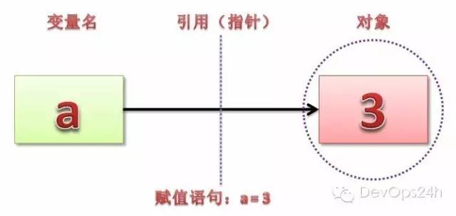
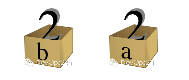
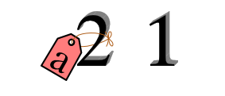

Python必读
--------

一切变量都是引用
~~~~~~~~

在许多其他语言中，赋值给一个变量将一个值放在一个盒子里。
::
    int a = 1;

盒子“a”现在包含一个整数 1

赋值另外一个值给同一个变量，替换盒子里的内容。
::
    a = 2;

盒子“a”现在包含一个整数 2

赋值一个变量给另外一个变量，等于是复制这个值，并且放到新的盒子里。
::
    int b = a;

“b”是另外一个盒子，包含一个复制的整数2. 盒子“a” 有一个单独的复制。

在Python中，一个“命名”或者‘变量’就像是一个贴在对象上的标签名。
::
    a = 1

这里，一个整数1对象有一个标签叫做“a”。
如果我们重新赋值“a”，我们仅仅只要移动标签到另外一个对象。
::
    a = 2

现在，这个命名“a”被贴在在一个整数2对象上。

原来的整数1对象不再拥有标签“a”,它可能还存在，但是我们不能通过命名“a” 获得它。（当一个对象不再有引用或者标签时，它将会从内存中释放）

如果我们复制一个命名给另外一个，我们只要贴上另外一个标签名给一个存在的对象。

b = a

这个命名“b” 只是另外一个绑在在同一个对象的标签，就像“a”一样。

尽管在Python中我们通常提到变量（因为，这是通用术语），真正含义是“标签”或者“标识符”。在Python中变量是值的标签，而不是被标记的盒子。

举例子说明：

在Python中，有这样一句话是非常重要的：**对象有类型，变量无类型。**

就好比是一个标签x，当x = 5时，就是将x这个标签拴在了5上了，通过这个x，就顺延看到了5。
于是在交互模式中，x输出的结果就是5，给人的感觉似乎是x就是5，事实是x这个标签贴在5上面。
同样的道理，当x = 6时，标签就换位置了，贴到6上面。

.. important::
    **python 中的赋值操作(=，等号)其实就是把"="左边的变量名(标签)打到"="右边的对象上。**

可变对象和不可变对象
~~~~~~~~

上面我们讲到python的一切变量名都是引用，参数传递方式是 **传址** 而 **不是传值** 。
继续看几个实例：
::
    >>> a = 1
    >>> b = a
    >>> print a,b,id(a),id(b) # id函数输出变量指向对象的内存地址
    1 1 18166136 18166136 # 此时a和b都指向对象 1
    >>> a = 2
    >>> print a,b,id(a),id(b)
    2 1 18166112 18166136 # 此时a指向了对象 2 ，而b还指向1
    >>> a = [1, 3, 4]
    >>> b = a
    >>> print a, b, id(a), id(b)
    [1, 3, 4] [1, 3, 4] 139799758056768 139799758056768 # a和b指向同样的对象

到目前为止和我们前面所讲是一样的，后面说些不一样的。

Python在heap中分配的对象分成两类：可变对象和不可变对象。所谓可变对象是指，对象的内容可变，而不可变对象是指对象内容不可变。

不可变（immutable）：int、字符串(string)、float、（数值型number）、元组（tuple)

可变（mutable）：字典型(dictionary)、列表型(list)

所谓的不可变对象就是指这个对象的内容是不能发生改变的。

你一定会说，神马？这和我认知的不一样啊！

我们举例说明：
::
    >>> a = 1
    >>> b = a
    >>> print a,b,id(a),id(b) # id函数输出变量指向对象的内存地址
    1 1 18166136 18166136 # 此时a和b都指向对象 1。
    >>> # 到这里和上面的例子是一样的,神奇的地方就要出现了,睁大你的双眼！
    >>> a += 2 # 我们把a进行运算，试图改变a。
    >>> # 按照前面所学，如果改变a指向对象的值，由于b和a指向同样的对象，b和a打印出的值应该都会变，对吧？
    >>> # no no no, too young too simple!
    >>> print a,b,id(a),id(b)
    3 1 18166088 18166136
    >>> # 发现没，b还是指向原来的对象1（内存地址是18166136，这个1并没有改变）。
    >>> # 而a指向了一个新的内存地址（18166088),其值是3

不可变对象的意思就是对象的值是不能改变的，那么当进行运算的是否怎么办？

**python会生成一个新的对象，其值就是运算后的结果，然后把这个新的对象赋给a。**

对于可变对象，就跟大家的认知一样了，举例说明：
::
    >>> a = [1, 3, 4]
    >>> b = a
    >>> print a,b,id(a),id(b)
    [1, 3, 4] [1, 3, 4] 139799778290504 139799778290504
    >>> a.append(5)
    >>> print a,b,id(a),id(b) # a 和 b 指向的仍然是原来的对象，并且其值发生了改变
    [1, 3, 4, 5] [1, 3, 4, 5] 139799778290504 139799778290504

