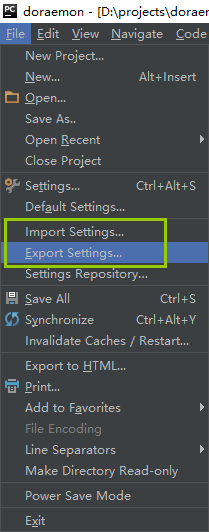
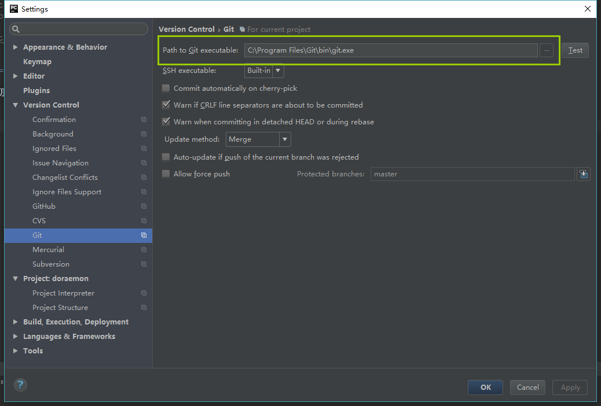
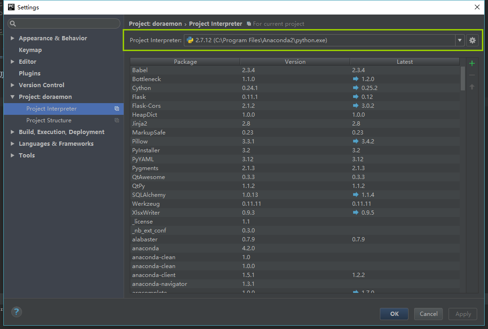
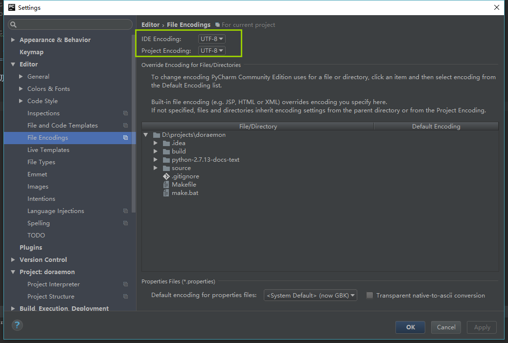
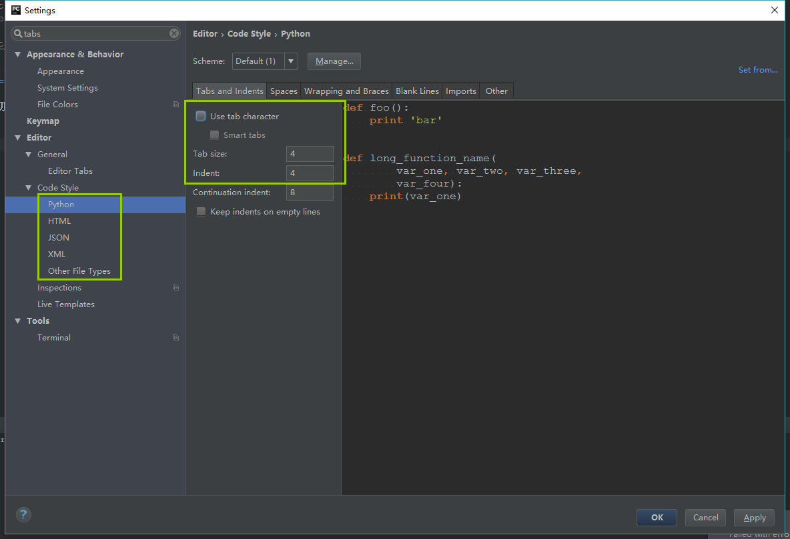
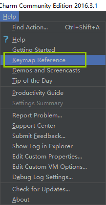

Python开发环境 - pycharm
--------

**pycharm是我用过的最牛逼的python IDE，没有之一！**

下载安装
~~~~~~

`官方地址：https://www.jetbrains.com/pycharm/download/#section=windows <https://www.jetbrains.com/pycharm/download/#section=windows>`__

下载 Community 版本，Professional 版本是收费的！

偏好设置
~~~~~~

导入导出
^^^^^

pycharm支持把所有配置项导入\导出功能，这样在你重新安装或者换电脑情况下，不用重新一项项设置，只需要导入原先的配置即可。

这里我提供我的配置，懒人直接下载下来导入即可。 :download:`pycharm settings.jar <media/settings.jar>`

绑定git
^^^^^

绑定python
^^^^^^^^

文件编码
^^^^^
建议选择 UTF-8 编码

空格代替tab
^^^^^^^

这里可以对不同的文件类型分别设置。

快捷键
~~~~~~

点击 工具栏 help -> Keymap Reference 可以查看完整的快捷键列表

这里列出常用的一些：

::

    ctrl + alt + L  美化代码。 在这个看脸的时代，代码颜值很重要！！！！
    ctrl + k  提交代码修改到git本地版本库，相当于 git commit
    ctrl + shift + k  提交代码修改到git远程库，相当于 git push
    ctrl + T 从git远程库更新代码到本地，相当于 git pull
    ctrl + D 复制光标所在行
    ctrl + Y 删除光标所在行
    ctrl + shift + up/down 上下移动光标所在行
    ctrl + / 注释/反注释光标所在行（或者选中的行）

版本管理 - vcs
~~~~~~

