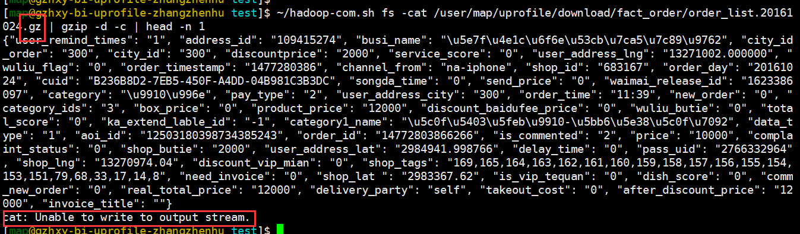

压缩打包
~~~~~~~~

**首先要弄清两个概念：打包和压缩。**

打包是指将一大堆文件或目录什么的变成一个总的文件;
压缩则是将一个大的文件通过一些压缩算法变成一个小文件.

Linux下的压缩文件剖析 

`*http://www.cnblogs.com/herbertchina/p/3935821.html* <http://www.cnblogs.com/herbertchina/p/3935821.html>`__

tar
^^^^

tar命令常用来 **打包并且压缩** 文件。

打包命令：
::

    tar -cf out_filename.tar file1 file2

解包命令：
::

    tar -xf out_filename.tar

打包的同时用指定压缩算法压缩数据：
::

    tar -czf out_filename.tar.gz file1 file2

解包的同时用指定压缩算法解压数据：
::

    tar -xzf out_filename.tar.gz file1 file2

压缩算法参数：
::

    -z 使用gzip压缩算法
    -j, --bzip2   使用bzip2压缩算法
    -J, --xz      使用xz压缩算法
        --lzip    使用lzip压缩算法
        --lzma    使用lzma压缩算法
        --lzop

.. hint::
    一般用 `tar` 命令打包的文件命名形式为 `xxxx.tar.gz` , 文件名包含两个扩展名，
    `.tar` 代表用 `tar` 命令打包的， `.gz` 代表使用的压缩算法是 `gzip` 。
    如果使用的是 `bzip2` 压缩算法第二个扩展名为 `.bz` 。

gzip
^^^^

使用 `gzip` 压缩算法对文件进行解/压缩。

.. hint::
    一般后缀名是 `.gz` 文件代表是 `gzip` 压缩过的文件。

用法：
::

    Usage: gzip [OPTION]... [FILE]...
    Compress or uncompress FILEs (by default, compress FILES in-place).

    Mandatory arguments to long options are mandatory for short options too.

      -c, --stdout      write on standard output, keep original files unchanged
      -d, --decompress  decompress
      -f, --force       force overwrite of output file and compress links
      -h, --help        give this help
      -l, --list        list compressed file contents
      -L, --license     display software license
      -n, --no-name     do not save or restore the original name and time stamp
      -N, --name        save or restore the original name and time stamp
      -q, --quiet       suppress all warnings
      -r, --recursive   operate recursively on directories
      -S, --suffix=SUF  use suffix SUF on compressed files
      -t, --test        test compressed file integrity
      -v, --verbose     verbose mode
      -V, --version     display version number
      -1, --fast        compress faster
      -9, --best        compress better
        --rsyncable   Make rsync-friendly archive

    With no FILE, or when FILE is -, read standard input.

示例：

解压缩HDFS上使用gzip压缩过的文件

zip/unzip
^^^^^^^^^

使用 `zip` 压缩算法对文件进行解/压缩。

.. hint::
    一般后缀名是 `.zip` 文件代表是 `zip` 压缩过的文件。

.. important::
    注意 `zip` 和 `gzip` 是不一样的哦，二者不能通用。

用法：
::

    Usage: zip [-options] [-b path] [-t mmddyyyy] [-n suffixes] [zipfile list] [-xi list]
      The default action is to add or replace zipfile entries from list, which
      can include the special name - to compress standard input.
      If zipfile and list are omitted, zip compresses stdin to stdout.
      -f   freshen: only changed files  -u   update: only changed or new files
      -d   delete entries in zipfile    -m   move into zipfile (delete OS files)
      -r   recurse into directories     -j   junk (don't record) directory names
      -0   store only                   -l   convert LF to CR LF (-ll CR LF to LF)
      -1   compress faster              -9   compress better
      -q   quiet operation              -v   verbose operation/print version info
      -c   add one-line comments        -z   add zipfile comment
      -@   read names from stdin        -o   make zipfile as old as latest entry
      -x   exclude the following names  -i   include only the following names
      -F   fix zipfile (-FF try harder) -D   do not add directory entries
      -A   adjust self-extracting exe   -J   junk zipfile prefix (unzipsfx)
      -T   test zipfile integrity       -X   eXclude eXtra file attributes
      -y   store symbolic links as the link instead of the referenced file
      -e   encrypt                      -n   don't compress these suffixes
      -h2  show more help

    Usage: unzip [-Z] [-opts[modifiers]] file[.zip] [list] [-x xlist] [-d exdir]
      Default action is to extract files in list, except those in xlist, to exdir;
      file[.zip] may be a wildcard.  -Z => ZipInfo mode ("unzip -Z" for usage).

      -p  extract files to pipe, no messages     -l  list files (short format)
      -f  freshen existing files, create none    -t  test compressed archive data
      -u  update files, create if necessary      -z  display archive comment only
      -v  list verbosely/show version info       -T  timestamp archive to latest
      -x  exclude files that follow (in xlist)   -d  extract files into exdir
    modifiers:
      -n  never overwrite existing files         -q  quiet mode (-qq => quieter)
      -o  overwrite files WITHOUT prompting      -a  auto-convert any text files
      -j  junk paths (do not make directories)   -aa treat ALL files as text
      -U  use escapes for all non-ASCII Unicode  -UU ignore any Unicode fields
      -C  match filenames case-insensitively     -L  make (some) names lowercase
      -X  restore UID/GID info                   -V  retain VMS version numbers
      -K  keep setuid/setgid/tacky permissions   -M  pipe through "more" pager
    See "unzip -hh" or unzip.txt for more help.  Examples:
      unzip data1 -x joe   => extract all files except joe from zipfile data1.zip
      unzip -p foo | more  => send contents of foo.zip via pipe into program more
      unzip -fo foo ReadMe => quietly replace existing ReadMe if archive file newer
