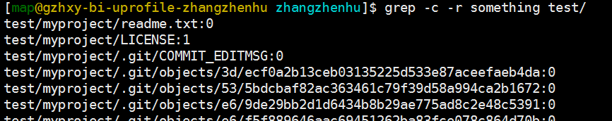

文本处理
~~~~~~~~

awk - 处理行文本
^^^^^^^^^^^
linux下最强大的文本分析处理工具， **这是必须学会的！！！**

三言两语也解释不清楚，自行百度学习吧。

grep/fgrep - 查找文件内容
^^^^^^^^^^^^^^^^^^^^^^
Linux grep命令用于查找文件里符合条件的字符串。

grep指令用于查找内容包含指定的范本样式的文件，
如果发现某文件的内容符合所指定的范本样式，
预设grep指令会把含有范本样式的那一列显示出来。
若不指定任何文件名称，或是所给予的文件名为"-"，则grep指令会从标准输入设备读取数据。

语法:
::

    grep [-abcEFGhHilLnqrsvVwxy][-A<显示列数>][-B<显示列数>][-C<显示列数>][-d<进行动作>][-e<范本样式>][-f<范本文件>][--help][范本样式][文件或目录...]

参数：
::

    -a或--text 不要忽略二进制的数据。
    -A<显示列数>或--after-context=<显示列数> 除了显示符合范本样式的那一列之外，并显示该列之后的内容。
    -b或--byte-offset 在显示符合范本样式的那一列之前，标示出该列第一个字符的位编号。
    -B<显示列数>或--before-context=<显示列数> 除了显示符合范本样式的那一列之外，并显示该列之前的内容。
    -c或--count 计算符合范本样式的列数。
    -C<显示列数>或--context=<显示列数>或-<显示列数> 除了显示符合范本样式的那一列之外，并显示该列之前后的内容。
    -d<进行动作>或--directories=<进行动作> 当指定要查找的是目录而非文件时，必须使用这项参数，否则grep指令将回报信息并停止动作。
    -e<范本样式>或--regexp=<范本样式> 指定字符串做为查找文件内容的范本样式。
    -E或--extended-regexp 将范本样式为延伸的普通表示法来使用。
    -f<范本文件>或--file=<范本文件> 指定范本文件，其内容含有一个或多个范本样式，让grep查找符合范本条件的文件内容，格式为每列一个范本样式。
    -F或--fixed-regexp 将范本样式视为固定字符串的列表。
    -G或--basic-regexp 将范本样式视为普通的表示法来使用。
    -h或--no-filename 在显示符合范本样式的那一列之前，不标示该列所属的文件名称。
    -H或--with-filename 在显示符合范本样式的那一列之前，表示该列所属的文件名称。
    -i或--ignore-case 忽略字符大小写的差别。
    -l或--file-with-matches 列出文件内容符合指定的范本样式的文件名称。
    -L或--files-without-match 列出文件内容不符合指定的范本样式的文件名称。
    -n或--line-number 在显示符合范本样式的那一列之前，标示出该列的列数编号。
    -q或--quiet或--silent 不显示任何信息。
    -r或--recursive 此参数的效果和指定"-d recurse"参数相同。
    -s或--no-messages 不显示错误信息。
    -v或--revert-match 反转查找。
    -V或--version 显示版本信息。
    -w或--word-regexp 只显示全字符合的列。
    -x或--line-regexp 只显示全列符合的列。
    -y 此参数的效果和指定"-i"参数相同。
    --help 在线帮助。

sed - 修改文件内容
^^^^^^^^^^^^^^^

Linux sed命令是利用script来处理文本文件。

sed可依照script的指令，来处理、编辑文本文件。

Sed主要用来自动编辑一个或多个文件；简化对文件的反复操作；编写转换程序等。

语法
::

    sed [-hnV][-e<script>][-f<script文件>][文本文件]

参数说明：
::

    -e<script>或--expression=<script> 以选项中指定的script来处理输入的文本文件。
    -f<script文件>或--file=<script文件> 以选项中指定的script文件来处理输入的文本文件。
    -h或--help 显示帮助。
    -n或--quiet或--silent 仅显示script处理后的结果。
    -V或--version 显示版本信息。
    动作说明：
    a ：新增， a 的后面可以接字串，而这些字串会在新的一行出现(目前的下一行)～
    c ：取代， c 的后面可以接字串，这些字串可以取代 n1,n2 之间的行！
    d ：删除，因为是删除啊，所以 d 后面通常不接任何咚咚；
    i ：插入， i 的后面可以接字串，而这些字串会在新的一行出现(目前的上一行)；
    p ：列印，亦即将某个选择的数据印出。通常 p 会与参数 sed -n 一起运行～
    s ：取代，可以直接进行取代的工作哩！通常这个 s 的动作可以搭配正规表示法！例如 1,20s/old/new/g 就是啦！

示例：

iconv - 转换文件编码
^^^^^^^^^^^^^^^^^^

用于转换文件编码

语法：
::

    Usage: iconv [OPTION...] [FILE...]
    Convert encoding of given files from one encoding to another.

     Input/Output format specification:
      -f, --from-code=NAME       encoding of original text
      -t, --to-code=NAME         encoding for output

     Information:
      -l, --list                 list all known coded character sets

     Output control:
      -c                         omit invalid characters from output
      -o, --output=FILE          output file
      -s, --silent               suppress warnings
          --verbose              print progress information

      -?, --help                 Give this help list
          --usage                Give a short usage message
      -V, --version              Print program version

示例：

cat/head/tail/more - 查看文件内容
^^^^^^^^^^^^^^^^^^^^^^^^^^

- cat 命令用于打印输出文件的全部内容，文件数据量大的时候禁用此命令，因为大文件一下输出所有内容会是的终端崩溃。
- head 命令用于打印输出文件的头部n行内容。
- tail 命令用于打印输出文件的尾部n行内容。
- more 命令用于逐步查看文件的内容，适用于查看大文件。

cut - 切割文件
^^^^^^^^

**使用说明:**

cut
命令从文件的每一行剪切字节、字符和字段并将这些字节、字符和字段写至标准输出。

如果不指定 File 参数，cut 命令将读取标准输入。必须指定 -b、-c 或 -f
标志之一。

**参数:**

-  -b
   ：以字节为单位进行分割。这些字节位置将忽略多字节字符边界，除非也指定了
   -n 标志。

-  -c ：以字符为单位进行分割。

-  -d ：自定义分隔符，默认为制表符。

-  -f ：与-d一起使用，指定显示哪个区域。

-  | -n ：取消分割多字节字符。仅和 -b
     标志一起使用。如果字符的最后一个字节落在由 -b 标志的 List
     参数指示的
   | 范围之内，该字符将被写出；否则，该字符将被排除

split - 切割文件
^^^^^^^^^^^

按行切割文件

文件管理
~~~~~~~~

find - 查找文件
^^^^^^^^^^^

.. image:: media/image076.png
    :align: center

tree - 查看目录树
^^^^^^^^^^^
Linux tree命令用于以树状图列出目录的内容。

执行tree指令，它会列出指定目录下的所有文件，包括子目录里的文件。

语法
::

    tree [-aACdDfFgilnNpqstux][-I <范本样式>][-P <范本样式>][目录...]

参数说明：
::

    -a 显示所有文件和目录。
    -A 使用ASNI绘图字符显示树状图而非以ASCII字符组合。
    -C 在文件和目录清单加上色彩，便于区分各种类型。
    -d 显示目录名称而非内容。
    -D 列出文件或目录的更改时间。
    -f 在每个文件或目录之前，显示完整的相对路径名称。
    -F 在执行文件，目录，Socket，符号连接，管道名称名称，各自加上"*","/","=","@","|"号。
    -g 列出文件或目录的所属群组名称，没有对应的名称时，则显示群组识别码。
    -i 不以阶梯状列出文件或目录名称。
    -I<范本样式> 不显示符合范本样式的文件或目录名称。
    -l 如遇到性质为符号连接的目录，直接列出该连接所指向的原始目录。
    -n 不在文件和目录清单加上色彩。
    -N 直接列出文件和目录名称，包括控制字符。
    -p 列出权限标示。
    -P<范本样式> 只显示符合范本样式的文件或目录名称。
    -q 用"?"号取代控制字符，列出文件和目录名称。
    -s 列出文件或目录大小。
    -t 用文件和目录的更改时间排序。
    -u 列出文件或目录的拥有者名称，没有对应的名称时，则显示用户识别码。
    -x 将范围局限在现行的文件系统中，若指定目录下的某些子目录，其存放于另一个文件系统上，则将该子目录予以排除在寻找范围外。

实例

以树状图列出当前目录结构。可直接使用如下命令：

pwd - 当前工作目录
^^^^^^^^^^^
显示当前工作目录的全路径

ln - 处理软连接
^^^^^^^^^^

软连接的介绍

`*http://www.ibm.com/developerworks/cn/linux/l-cn-hardandsymb-links/* <http://www.ibm.com/developerworks/cn/linux/l-cn-hardandsymb-links/>`__

readlink - 查看文件绝对路径
^^^^^^^^^^^^^^^^^^^

df - 查看磁盘设备信息
^^^^^^^^^^^^
Linux df命令用于显示目前在Linux系统上的文件系统的磁盘使用情况统计。

语法
::

    df [选项]... [FILE]...
    -a, --all 包含所有的具有 0 Blocks 的文件系统
    --block-size={SIZE} 使用 {SIZE} 大小的 Blocks
    -h, --human-readable 使用人类可读的格式(预设值是不加这个选项的...)
    -H, --si 很像 -h, 但是用 1000 为单位而不是用 1024
    -i, --inodes 列出 inode 资讯，不列出已使用 block
    -k, --kilobytes 就像是 --block-size=1024
    -l, --local 限制列出的文件结构
    -m, --megabytes 就像 --block-size=1048576
    --no-sync 取得资讯前不 sync (预设值)
    -P, --portability 使用 POSIX 输出格式
    --sync 在取得资讯前 sync
    -t, --type=TYPE 限制列出文件系统的 TYPE
    -T, --print-type 显示文件系统的形式
    -x, --exclude-type=TYPE 限制列出文件系统不要显示 TYPE
    -v (忽略)
    --help 显示这个帮手并且离开
    --version 输出版本资讯并且离开

实例
显示文件系统的磁盘使用情况统计：

第一列指定文件系统的名称，

第二列是分区的总大小。

第三列是分区已使用的空间大小。

第四列是分区剩余空间大小。

du - 计算文件大小
^^^^^^^^^^

du会显示指定的目录或文件所占用的磁盘空间。

语法
::

    du [-abcDhHklmsSx][-L <符号连接>][-X <文件>][--block-size][--exclude=<目录或文件>][--max-depth=<目录层数>][--help][--version][目录或文件]

参数说明：
::

    -a或-all 显示目录中个别文件的大小。
    -b或-bytes 显示目录或文件大小时，以byte为单位。
    -c或--total 除了显示个别目录或文件的大小外，同时也显示所有目录或文件的总和。
    -D或--dereference-args 显示指定符号连接的源文件大小。
    -h或--human-readable 以K，M，G为单位，提高信息的可读性。
    -H或--si 与-h参数相同，但是K，M，G是以1000为换算单位。
    -k或--kilobytes 以1024 bytes为单位。
    -l或--count-links 重复计算硬件连接的文件。
    -L<符号连接>或--dereference<符号连接> 显示选项中所指定符号连接的源文件大小。
    -m或--megabytes 以1MB为单位。
    -s或--summarize 仅显示总计。
    -S或--separate-dirs 显示个别目录的大小时，并不含其子目录的大小。
    -x或--one-file-xystem 以一开始处理时的文件系统为准，若遇上其它不同的文件系统目录则略过。
    -X<文件>或--exclude-from=<文件> 在<文件>指定目录或文件。
    --exclude=<目录或文件> 略过指定的目录或文件。
    --max-depth=<目录层数> 超过指定层数的目录后，予以忽略。
    --help 显示帮助。
    --version 显示版本信息。

实例

