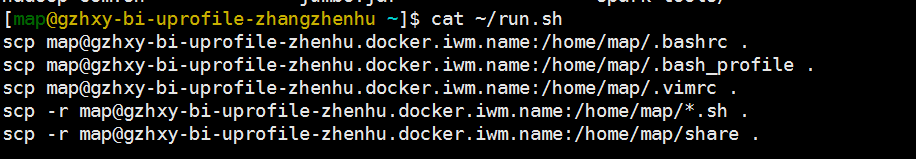

数据传输
~~~~~~~~

在日常工作中，涉及到下载传输数据的场景一般有两种：

- 两台机器间传输数据
    通常用 `wget` 或者 `scp` 。
- 从互联网上下载网页或者软件包
    通常用 `wget` 或者 `curl` 。

wget
^^^^

常用来从互联网下载网页、数据包等等。

支持 ftp 和 http(s) 协议

常见用法：
::

    wget -O taglist.zip http://www.vim.org/scripts/download\_script.php?src\_id=7701

当用来从互联网下载网页或者数据时，很简单，就用上面的方式即可。
当用于从一台机器拉取数据时，要求数据源机器必须开通ftp协议。

curl
^^^^

高级灵活的互联网网页抓取工具，可以自定义协议头、cookie等等，功能强大。

支持 http(s) 协议

scp
^^^

scp命令使用的是ssh协议，ssh协议是不支持匿名的。
一般要求提供用户名、密码才可以连接，所以使用scp命令传出数据必须有数据源机器的账号密码才行。

scp [可选参数] file\_source file\_target

网络
~~~~

netstat
^^^^^^^

hostname
^^^^^^^^^

查看本机的完整的机器名

