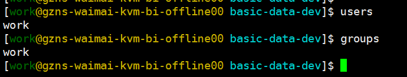
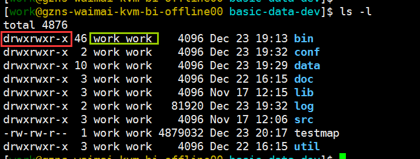

权限处理
~~~~~~~~

我们先来聊一聊linux下的权限管理策略。
linux下是存在一个用户（账号）体系的，要登陆linux必须使用某一个用户（账号）身份进行登陆，比如常见的root、work等等。
除此之外linux还对用户（账号）进行了分组，亦即用户组（group），当用户数量众多时，通过分组管理会方便很多。
每个用户必须属于一个用户组，不能独立于组外。

通过命令 `users` 和 `groups` 可以分别查看当前登陆者的用户名和所属的用户组名。

    上图中当前用户名和用户组名都是 `work`

在linux系统中不同的用户（组）是拥有不同的权限的，这里包括文件的访问、文件的写入、命令执行等等。
linux下的每个文件（夹）都必有一个所有者（用户），一般是创建了这个文件（夹）的用户，而每个用户都必然属于某个用户组。

在任意位置，我们执行命令 `ls -l` ,看下这个命令的输出结果：

`ls -l` 命令列出了当前目录下的文件（夹），并且显示出了每个文件（夹）的详细信息。
红色框中（第一列）的内容是当前的文件（夹）的权限信息，绿色框中（第三四列）的内容是当前文件（夹）的所有者的用户（组）名称。

第一列的含义：
::
    - 第一个字符代表是文件（-）、目录（d）、链接（l）

    - 其余字符每3个一组（rwx），读（r）、写（w）、执行（x）

    - 第一组rwx：文件所有者的权限是读、写和执行

    - 第二组rw-：与文件所有者同一组的其它用户的权限是读、写但不能执行

    - 第三组r--：不与文件所有者同组的其他用户的权限是读不能写和执行

第三四列的含义：
::
    - 第三列是当前文件（夹）的所有者用户名称
    - 第四列是当前文件（夹）的所有者所属的用户组名称

当我们对一个文件进行操作时，如果没有对应的权限，我们是无法操作的，一般会提示 `Permission denied` 。
比如文件 `/etc/passwd` ，其所有者是 `root` ，我们的 `work` 账号没有这个文件的 **写** 权限，所是无法删除这个文件的。

.. image:: media/image003.png
    :align: center

.. hint::
    一般情况下，我们遇到 `Permission denied` 错误提示，都是权限问题。

chown - 更改文件所有者
^^^^^^^^^^^^^^^

这个命令是用来改变一个文件的拥有者的，用户可以是用户名或者用户ID；组可以是组名或者组ID；
文件是以空格分开的要改变权限的文件列表，支持通配符。
一般来说，这个指令只有是由系统管理者(root)所使用，一般使用者没有权限可以改变别人的文件拥有者，
也没有权限可以自己的文件拥有者改设为别人。只有系统管理者(root)才有这样的权限。

语法:
::
    chown [-cfhvR] [--help] [--version] user[:group] file...

参数:
::
    user : 新的文件拥有者的使用者 ID
    group : 新的文件拥有者的使用者群体(group)
    -c : 若该文件拥有者确实已经更改，才显示其更改动作
    -f : 若该文件拥有者无法被更改也不要显示错误讯息
    -h : 只对于连结(link)进行变更，而非该 link 真正指向的文件
    -v : 显示拥有者变更的详细资料
    -R : 对目前目录下的所有文件与子目录进行相同的拥有者变更(即以递回的方式逐个变更)
    --help : 显示辅助说明
    --version : 显示版本

实例:

将文件 file1.txt 的拥有者设为 users 群体的使用者 jessie :
::
    chown jessie:users file1.txt
将目前目录下的所有文件与子目录的拥有者皆设为 users 群体的使用者 lamport :
::
    chmod -R lamport:users *

chgrp - 更改文件所属用户组
^^^^^^^^^^^^^^^^^

Linux chgrp命令用于变更文件或目录的所属群组。
在UNIX系统家族里，文件或目录权限的掌控以拥有者及所属群组来管理。您可以使用chgrp指令去变更文件与目录的所属群组，设置方式采用群组名称或群组识别码皆可。

语法:
::
    chgrp [-cfhRv][--help][--version][所属群组][文件或目录...]
    或 chgrp [-cfhRv][--help][--reference=<参考文件或目录>][--version][文件或目录...]

参数说明:
::
    -c或--changes 效果类似"-v"参数，但仅回报更改的部分。
    -f或--quiet或--silent 　不显示错误信息。
    -h或--no-dereference 　只对符号连接的文件作修改，而不更动其他任何相关文件。
    -R或--recursive 　递归处理，将指定目录下的所有文件及子目录一并处理。
    -v或--verbose 　显示指令执行过程。
    --help 　在线帮助。
    --reference=<参考文件或目录> 　把指定文件或目录的所属群组全部设成和参考文件或目录的所属群组相同。
    --version 　显示版本信息。

实例:

改变文件的群组属性：
::
    chgrp -v bin log2012.log
输出：
::
    [root@localhost test] ll
    ---xrw-r-- 1 root root 302108 11-13 06:03 log2012.log
    [root@localhost test] chgrp -v bin log2012.log
    "log2012.log" 的所属组已更改为 bin
    [root@localhost test] ll
    ---xrw-r-- 1 root bin  302108 11-13 06:03 log2012.log

chmod - 更改文件权限
^^^^^^^^^^^^^^

利用 chmod 更改文件的权限控制。

语法：
::
    chmod [-cfvR] [--help] [--version] mode file...

参数说明:
::
    mode : 权限设定字串，格式: [ugoa...][[+-=][rwxX]...][,...]
    其中：
        - u 表示该文件的拥有者，g 表示与该文件的拥有者属于同一个群体(group)者，o 表示其他以外的人，a 表示这三者皆是。
        - + 表示增加权限、- 表示取消权限、= 表示唯一设定权限。
        - r 表示可读取，w 表示可写入，x 表示可执行，X 表示只有当该文件是个子目录或者该文件已经被设定过为可执行。
    -c : 若该文件权限确实已经更改，才显示其更改动作
    -f : 若该文件权限无法被更改也不要显示错误讯息
    -v : 显示权限变更的详细资料
    -R : 对目前目录下的所有文件与子目录进行相同的权限变更(即以递回的方式逐个变更)
    --help : 显示辅助说明
    --version : 显示版本

实例:

将文件 file1.txt 设为所有人皆可读取 :
::
    chmod ugo+r file1.txt

将文件 file1.txt 设为所有人皆可读取 :
::
    chmod a+r file1.txt

将文件 file1.txt 与 file2.txt 设为该文件拥有者，与其所属同一个群体者可写入，但其他以外的人则不可写入 :
::
    chmod ug+w,o-w file1.txt file2.txt

将 ex1.py 设定为只有该文件拥有者可以执行 :
::
    chmod u+x ex1.py

将目前目录下的所有文件与子目录皆设为任何人可读取 :
::
    chmod -R a+r *

此外chmod也可以用数字来表示权限如 :
::
    chmod 777 file

语法为：
::
    chmod abc file
    其中a,b,c各为一个数字，分别表示User、Group、及Other的权限。
    **r=4，w=2，x=1**

        - 若要rwx属性则4+2+1=7；
        - 若要rw-属性则4+2=6；
        - 若要r-x属性则4+1=5。

    chmod a=rwx file 和 chmod 777 file 效果相同

    chmod ug=rwx,o=x file 和  chmod 771 file 效果相同

    若用 chmod 4755 filename 可使此程序具有root的权限

